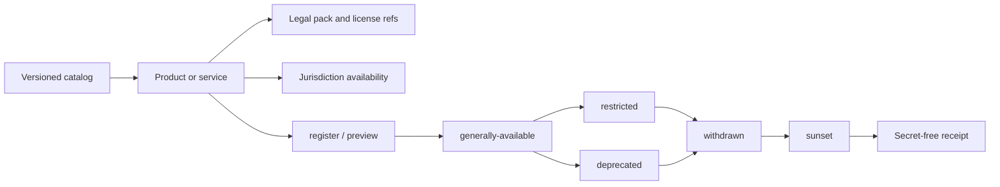
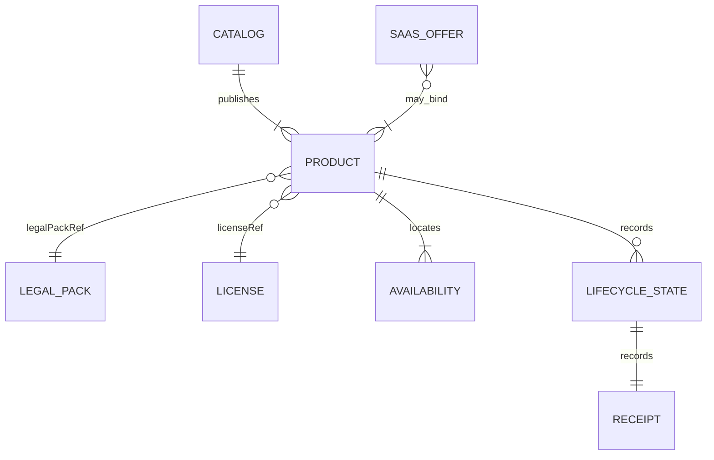

# Product Lifecycle architecture

## Scope and standard composition

The product lifecycle standard describes versioned products and services. It
does not price them, bill customers, store personal data or deploy tenants.

- `wellmanifest/dsl` constrains catalog requests;
- POA compiles requests into exact plans, grants and receipts;
- `wellmanifest/legal-lifecycle` owns licenses, policies and location rules;
- `wellmanifest/saas-lifecycle` may later bind `productRef` values from a
  catalog into a commercial offer;
- deployment and payment systems remain external authorities.

## Normative invariants

1. Every public catalog MUST be versioned and identify a default legal pack.
2. A product MUST declare kind, stage, license, legal pack, entitlements and
   at least one jurisdiction availability row.
3. `draft` products MUST NOT be `public`.
4. `generally-available` and `restricted` products MUST have at least one
   `offered` jurisdiction. All-prohibited release fails closed.
5. A product MUST NOT name itself as successor.
6. `sunset` state MUST include `sunsetAt`. Withdrawn and sunset are distinct
   honest states.
7. Requests MUST NOT carry prices, settlement, marketing copy, hostnames or
   credentials. Commercial amounts stay in `saas-lifecycle`.
8. License and legal-pack fields are opaque references into
   `legal-lifecycle`. This module does not interpret SPDX text.
9. Receipts MUST set `secretsRedacted=true` and `commercialDataStored=false`.
10. Documents never prove that a product may be sold; they only record the
    catalog state and the bound legal references.

## Trust boundaries

| Boundary | Owns | Must reject |
| --- | --- | --- |
| Product catalog | Identity, stage, entitlements | Prices, license text, deployment hosts |
| Legal pack | Location and license meaning | Product stage transitions |
| SaaS offer | Plans, trials, settlement | Inventing a product identity |
| Obligation store | Accepted legal bindings | Catalog mutation |
| Receipt store | Redacted outcome hashes | Marketing copy or commercial payloads |

## Composition with legal and SaaS lifecycles

The hierarchy is `catalog → product → legal pack → jurisdiction
availability`. A SaaS plan may later point at a `productRef`; it cannot
replace this catalog or invent availability.
