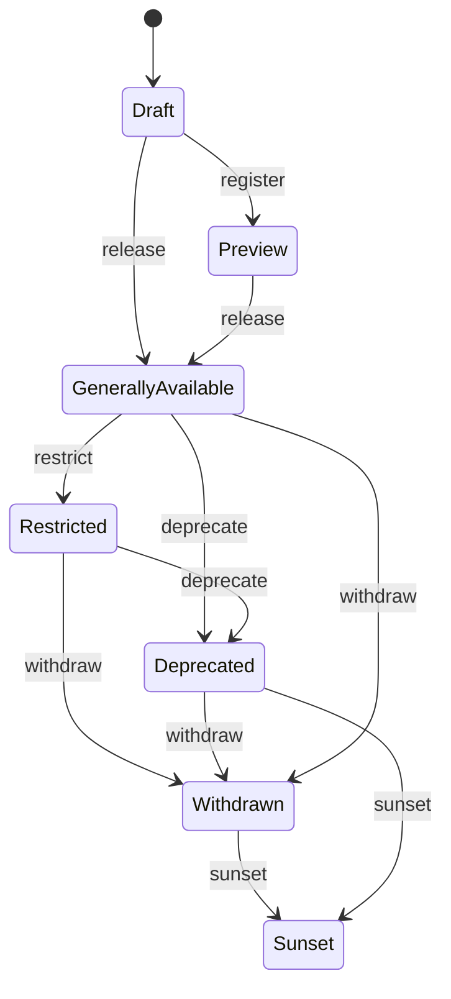
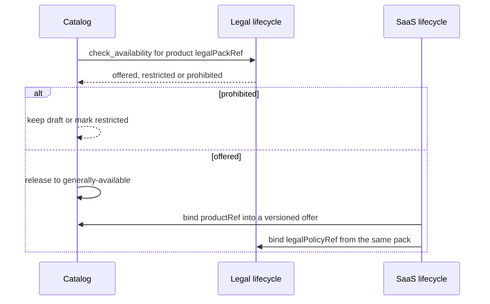

# Product Lifecycle logic flow

## Register, release and sunset

`inspect` never changes stage. A public draft is rejected before any
transition.

## Catalog, legal pack and SaaS offer

Retries of `release` for the same `productRef` and catalog version are
idempotent. A later restriction does not rewrite history; it publishes a
new stage with a new state version.

## Failure routing

| Failure | Required state/outcome | Safe next action |
| --- | --- | --- |
| Public draft | `denied` | keep `public=false` until preview or GA |
| GA with every jurisdiction prohibited | `denied` | bind a legal pack that offers a location |
| Product succeeds itself | `denied` | name a different `productRef` |
| Request contains price or settlement | `denied` | move amounts to saas-lifecycle |
| Request contains hostname | `denied` | use opaque deployment refs |
| Sunset without `sunsetAt` | `failed` | add an explicit date |
| Active state with no offered location | `failed` | restrict or withdraw honestly |
| Receipt stores commercial data | `failed` | redact and re-issue |

No failure path stores a price or turns a transport-level success into a
generally-available product.
